# VOULA Mail — Email Security Audit



Poor email authentication (SPF, DKIM, DMARC) is one of the most common —
and most overlooked — security gaps for businesses today, leaving them
exposed to spoofing, phishing, and deliverability issues that quietly
hurt both security and reach. VOULA Mail audits a domain's full email
security posture in minutes and produces a clear, client-ready report:
a 100-point score, a breakdown by protocol, and a prioritized
remediation roadmap anyone — technical or not — can act on.

Built by Djambae Mistoih, founder of VOULA — a cybersecurity
consultancy specialized in email authentication and application
security.

A complete React/Vite MVP for VOULA Mail: a professional email security
audit tool covering SPF, DKIM, DMARC, DNSSEC, MTA-STS, TLS-RPT, and BIMI,
with a 100-point score and a client-ready PDF report.

## Quick start

```bash
npm install
npm run dev
```

The app works out of the box: the free scan queries public DNS
resolvers directly (Cloudflare, falling back to Google) — no backend
required.

```bash
npm run build     # production build in dist/
npm run preview   # preview the build
```

## About the logo

The official logo has been received and integrated: the supplied file
was auto-vectorized (connected-component detection + outline
simplification), the pixelation was cleaned up, and the outer ring was
removed per request — a single solid circle now carries the monogram.

- `src/components/Logo.jsx` — React logo (badge + wordmark), vector
  path embedded inline, no network request
- `public/logo-badge.svg`, `public/logo-mark.svg` — standalone SVG
  assets
- `public/favicon.svg` — favicon
- `src/assets/logoBadge.js` — high-res PNG in base64, used by the PDF
  generator (jsPDF can't read SVGs)

The logo's exact color (#0005E6) is kept for the monogram. The word
"Mail" in the wordmark uses the interface's indigo (#8B8AFB) instead of
the logo blue: that highly saturated blue, used as text on a dark
background, doesn't have enough contrast — which is in fact what made
the score unreadable in an earlier version of the PDF report (see
below).

## Architecture

```
src/
 ├── assets/            (reserved for future static assets)
 ├── components/
 │   ├── ui/             design system (Button, Input, Card, Badge, Alert,
 │   │                    Modal, Progress, Score, Tooltip, Loading, EmptyState)
 │   ├── layout/          Navbar, Footer
 │   ├── landing/         Hero, Features, Stats, SecuritySection, FAQ, CTA,
 │   │                    DomainSearch
 │   └── results/         ModuleCard, DetailPanel, ScoreBreakdown
 ├── context/            ScanContext (global state for the active scan)
 ├── hooks/               (reserved for future shared hooks)
 ├── layouts/             RootLayout (navbar + footer + <Outlet/>)
 ├── lib/
 │   ├── audit/           audit engine: one independent module per
 │   │                    protocol (spf.js, dkim.js, dmarc.js, dnssec.js,
 │   │                    mtaSts.js, tlsRpt.js, bimi.js, mx.js, reverseDns.js,
 │   │                    smtp.js), scoring.js (tunable weight table) and
 │   │                    index.js (orchestrator)
 │   └── pdf/              pdfReport.js — PDF report generator
 ├── pages/                LandingPage, ScannerPage, LoginPage, PremiumPage,
 │                         LegalPage
 ├── services/             dohClient.js (DNS-over-HTTPS client),
 │                         premiumVerification.js (premium API contract)
 ├── styles/               index.css (Tailwind + design tokens)
 ├── utils/                cn.js
 ├── App.jsx               routes
 └── main.jsx               entry point
```

## Audit engine

Each protocol is an independent module in `src/lib/audit/`, exporting
an `auditXxx(domain)` function that returns an object
`{ id, label, status, ...details, issues, recommendations }`. No
monolithic script: adding a new protocol just means adding a file and
registering it in `AUDIT_MODULES` (`src/lib/audit/index.js`).

The DKIM module tests 60+ known selectors (see `dkimSelectors.js`),
grouped by provider (Google, Microsoft, Mailgun, SendGrid, Brevo, OVH,
Plesk, cPanel, Postfix, Exim, etc.) and easy to extend.

## Score

The score calculation (out of 100) is centralized in
`src/lib/audit/scoring.js`, with an explicit weight table
(`SCORE_WEIGHTS`) that can be tuned without touching the audit modules.

## Premium feature — real-mailbox verification

The architecture is ready (`src/services/premiumVerification.js`,
`src/pages/PremiumPage.jsx`): it generates a disposable audit address,
waits for a message to arrive, then analyzes the DKIM signature
produced under real-world conditions. Until a backend is connected (the
`VITE_VOULA_API_URL` variable is unset), the flow runs in a clearly
labeled demo mode, so the full UX can already be tested end to end.

## PDF report — rebuilt engine

`src/lib/pdf/` generates a report styled like a professional
cybersecurity audit, split into four modules:

- `pdfTheme.js` — visual tokens (print-friendly light palette,
  guaranteed contrast), drawing primitives (measured text, status
  icons, badges)
- `pdfLayout.js` — the `PdfFlow` controller: vertical cursor, running
  header, **automatic page breaks** whenever a block no longer fits
  (`ensure(neededHeight)`), pagination applied as a final pass
- `pdfCharts.js` — circular score gauge with risk level (Excellent /
  Good / Average / Poor), stacked compliance bar, per-protocol status
  matrix
- `pdfReport.js` — orchestrator: cover page, executive summary,
  detailed results as cards, prioritized remediation roadmap (P1
  critical / P2 to watch), methodology page + signature + QR code

**Every block height is computed dynamically** from actually measured
text (`measureText`) before it's drawn: nothing has a fixed size, which
rules out overflow regardless of content (long domain names, long DNS
records, many recommendations). Triggered from `ScannerPage` via the
"PDF Report" button.

The risk level (`scoreLabel` in `src/lib/audit/scoring.js`) is shared
between the web UI and the PDF so they always stay consistent.

## Provider detection and tailored recommendations

`src/lib/audit/providerDetection.js` analyzes the DNS signals already
collected (MX hosts, SPF content, active DKIM selectors, name servers)
to automatically identify:
- the likely **DNS host** (where to log in to edit the zone);
- the likely **email provider** (Google Workspace, Microsoft 365,
  Zoho, Brevo, Mailgun, SendGrid, OVH, LWS...).

`src/lib/audit/providerGuides.js` holds the matching knowledge base
(DNS-panel login steps, provider-specific DKIM/SPF quirks). The PDF
report shows a "Detected infrastructure" block in the executive
summary, a "Where to make these fixes" note at the top of the
roadmap, and inlines provider-specific steps directly into module
cards and roadmap items whenever available. The web UI surfaces the
same detection via `ProviderInsights.jsx`, injected into the detail
panel (`DetailPanel.jsx`).

Detection is heuristic and presented as such: it points the user in
the right direction without claiming absolute certainty. Adding a new
provider only requires an entry in `providerGuides.js` and a detection
signature in `providerDetection.js`.

## Authentication — current status

**The login system is not production-ready.**
`src/context/AuthContext.jsx` simulates a full cycle (login, sign-up,
logout, session persisted in `localStorage`) so the UI, navbar, and one
protected route (`/premium`, via
`src/components/auth/ProtectedRoute.jsx`) are already wired up and
testable — but no real backend is connected: any email address is
accepted without verification, and the "session" is just a value
readable in the browser's `localStorage`.

What's still needed before going to production:

- **Authentication backend**: a dedicated API or a third-party service
  (Supabase Auth, Auth0, Clerk, Firebase Auth...). No password should
  ever be checked client-side.
- **Server-side password hashing** (bcrypt/argon2) — passwords must
  never be stored or transmitted in plain text beyond the initial
  HTTPS POST.
- **Secure sessions**: `httpOnly` + `Secure` + `SameSite` cookies, or
  server-signed JWTs with refresh-token rotation — not a
  JavaScript-readable session like the current mock.
- **CSRF protection** on mutating endpoints.
- **Email verification** (signed, expiring link) before full account
  activation.
- **Password recovery** (signed, expiring, single-use link).
- **Rate limiting / brute-force protection** on login attempts.
- **Server-side authorization checks** on every sensitive endpoint:
  `ProtectedRoute` is purely a client-side navigation convenience,
  never a security boundary on its own — a direct API call must be
  blocked independently of the front-end router.

Once a backend is chosen, integration is limited to replacing the
internal `login`/`register`/`logout` implementation in
`AuthContext.jsx` with real API calls: no consuming component
(`Navbar`, `LoginPage`, `ProtectedRoute`) needs to change, following
the same pattern as `premiumVerification.js`.

## Known limitation — SMTP module

Browsers can't open a raw TCP socket to port 25, so the `smtp.js`
module only evaluates the signals available client-side (MX host
resolution) and explicitly documents that a backend component is
needed for a full SMTP banner / STARTTLS check — consistent with the
Premium feature planned in the spec.

## Stack

React 18 · Vite 5 · Tailwind CSS 3 · React Router 6 · jsPDF · qrcode ·
lucide-react
